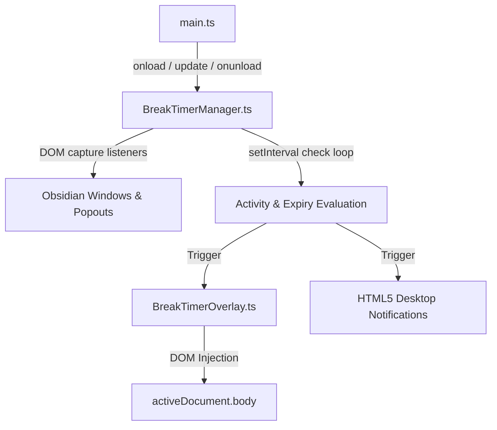
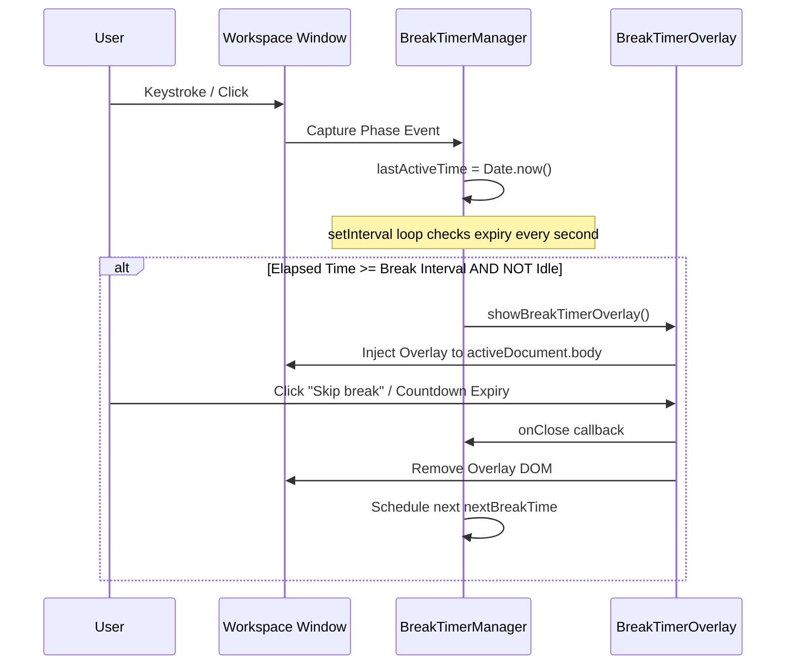

# Break Timer Architecture

The **Break Timer** feature provides system-wide inactive state monitoring and coordinates wellness overlays. It runs as a lifecycle-aware manager on top of Obsidian's workspace framework.

## Components & Structure

### 1. BreakTimerManager
Located at [BreakTimerManager.ts](file:///d:/Codes/plugin-full-calendar/src/features/break_timer/BreakTimerManager.ts).
The central manager class which implements the core timers, activity monitoring, and popup hook lifecycles.  

- **Activity Interception**: Instead of listening in the bubble phase, the manager attaches capture-phase event listeners (`{ capture: true }`) to intercept activity events (`mousedown`, `mousemove`, `keydown`, `scroll`, `touchstart`, `click`). This ensures that user interactions are caught even if editor frameworks (such as CodeMirror) call `event.stopPropagation()`.
- **Multi-Window Sync**: Tracks all open windows dynamically via an `attachedWindows` set and binds listeners to new popout windows by listening to the Obsidian workspace `'window-open'` event.
- **Background Checks**: Evaluates the inactivity and interval ticks every second. If `Date.now() - lastActiveTime > idleThreshold`, the timer is postponed rather than triggered, and resets once activity is detected again.

### 2. BreakTimerOverlay
Located at [BreakTimerOverlay.ts](file:///d:/Codes/plugin-full-calendar/src/features/break_timer/BreakTimerOverlay.ts).
Maintains DOM injection and animations.  

- **Overlay Construction**: Dynamically appends a fullscreen glassmorphic `div` container to `activeDocument.body` using `backdrop-filter: blur(12px)`.
- **Animations**:
  - Cat walk animation: The ASCII cat walking is animated by modifying `pre.textContent` across a 4-frame walk cycle every 250ms.
  - Horizontal translation: Keyframes (`ofc-cat-walk`) slide the cat horizontally while flipping its scale so it turns and walks back.
- **Timers**: Increments countdown variables and updates progress bar CSS width dynamically.

### 3. UI Settings
Located at [renderBreakTimerSettings.ts](file:///d:/Codes/plugin-full-calendar/src/features/break_timer/ui/renderBreakTimerSettings.ts).
Hooks into standard Obsidian settings components to configure interval sizes, idle limits, and toggle state updates in `FullCalendarSettings`.

## Data Flow

