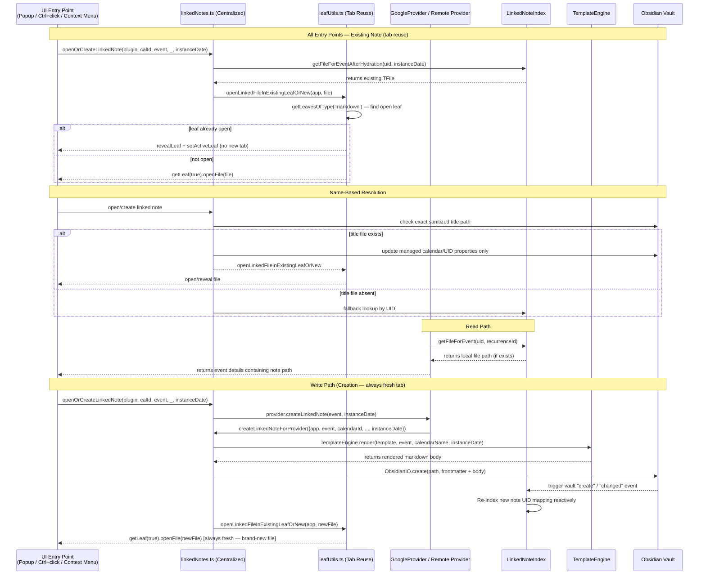

# Event Linked Notes Architecture

!!! abstract "Linked Notes contract"
    Event Linked Notes allow non-markdown remote events (e.g. Google Calendar, CalDAV, Outlook) to be associated with local Obsidian markdown notes. This relationship must remain completely decoupled from the core synchronization and caching engine, adhering strictly to **core-blindness**.

## Core model

| Component | Responsibility | Coupling |
|---|---|---|
| `LinkedNoteIndex` | Reactive index matching remote event UIDs and recurrence IDs to Obsidian file paths. Supports compound key mapping (`eventUid::recurrenceId`) for instance-level note lookup. | Listens to Obsidian vault events; decoupled from [EventStore](../event-storage.md#eventstore-model). |
| `TemplateEngine` | Renders a clean markdown body from event fields using a custom layout. | Pure functional renderer; no file system or vault side effects. |
| `createLinkedNoteForProvider` | Centralized helper that resolves or creates a linked note according to the configured strategy. | Combines exact title-path lookup, `LinkedNoteIndex`, `TemplateEngine`, `noteUtils`, and frontmatter utilities in a single DRY entry point. |
| `linkedNoteResolution` | Pure, non-mutating title-path resolver shared by creation/open flows and calendar hover preview. | Reads linked-note settings and performs one exact vault-path lookup; never scans or writes files. |
| `linkedNoteHover` | Builds Obsidian Page Preview payloads from native event `mouseover` input. | Resolves name-based title identity first, falls back to cached file location, and scopes hover state to the individual event element. |
| `openOrCreateLinkedNote` | Single open/create orchestrator shared by all three UI entry points (popup note button, Ctrl/Cmd+click, context menu). Delegates to `createLinkedNote` on the provider; uses `openLinkedFileInExistingLeafOrNew` to reveal an already-open tab. | Consumes provider and workspace APIs; no direct vault I/O. |
| `openLinkedFileInExistingLeafOrNew` | Tab-reuse utility. Walks `getLeavesOfType('markdown')` for an already-open leaf; reveals and focuses it. Falls through to a fresh tab only when the file is not yet open. Kept in `utils/leafUtils.ts` to avoid a circular import with `eventActions`. | Pure Obsidian workspace adapter; no event or note business logic. |
| `EventContextMenuBuilder` | Builds the right-click context menu. For providers with `createLinkedNote`, the `buildNavigationActions` function replaces the local-only "Go to note" item with an "Open linked note" item that calls `openOrCreateLinkedNote` with the correct `instanceDate` for recurring events. | UI-only; reads provider capabilities from `ProviderRegistry`. |
| `ViewEventInteractionHandler` | Handles all direct calendar interactions. Ctrl/Cmd+click now falls through to `openOrCreateLinkedNote` when the provider supports linked notes but no note exists yet. | Delegates to `openOrCreateLinkedNote`; no direct vault I/O. |
| `noteUtils` | General file-handling, title sanitization, and YAML serialization. | Shared file utility layer; DRY wrapper around Obsidian API. |
| Remote Providers | Delegate to `createLinkedNoteForProvider` for note creation; query `LinkedNoteIndex` during event reads. | Zero manual frontmatter construction in providers. |

---

## Identity Sources

Deadline-based identity and renamed/moved-note recovery are **frontmatter-driven**. The canonical identifiers are:  

* `fc-event-uid`
* `fc-calendar-id`
* `fc-event-recurrence-id` for deadline-based instance-specific recurring notes

In name-based mode, the exact sanitized title path inside the configured linked-notes directory is the primary lookup key. When that file is reused or created, the plugin attaches the stable calendar/UID identifiers so `LinkedNoteIndex` can continue resolving it after a later rename or move.

Rendered body text and cache state are never authoritative.

## Architectural Principles & SOLID Boundaries

To prevent architectural regression, this feature is built on three strict modular invariants:  

### 1️⃣ Core-Blindness (SOLID: Open-Closed Principle)
The core synchronization layers ([EventCache](../eventcache.md)), in-memory indexing ([EventStore](../event-storage.md#eventstore-model)), and the global provider registry are **100% blind** to the existence of linked notes. 
Instead of the core mapping files to events:  

1. Remote providers (such as `GoogleProvider` or `CalDAVProvider`) retrieve their events from the cloud.
2. In the `getEvents()` read-path, the provider queries the local `LinkedNoteIndex` for any notes containing the event's `fc-event-uid` (or matching calendar/UID frontmatter parameters).
3. If found, the provider includes the local note path under `EventLocation` in the event payload, allowing the UI to reactively render editing/viewing options.
4. The provider registry and caching system treat this like standard event metadata, completely unaware of the active link.

### 2️⃣ Standalone Body Templating (SOLID: Single Responsibility Principle)
To avoid vault contamination and ensure data cleanliness:
* The frontmatter of the linked note remains **managed and scoped**. Shared linked-note identity uses fields such as `fc-event-uid` and `fc-calendar-id`; CalDAV task notes may additionally manage scheduled/due properties.
* All rich metadata (title, formatted date, times, location, description, and source calendar name) is rendered directly inside the **body** of the note.
* Note body template rendering is handled by the pure `TemplateEngine` component. For a detailed breakdown of the templating engine's architecture, see **[Note Templating Architecture](templates.md)**.

### 3️⃣ Reactive Indexing
Rather than executing expensive, repetitive full-vault scans on every calendar load:  

* `LinkedNoteIndex` builds and maintains a fast, reactive in-memory index map.
* It leverages Obsidian's native `MetadataCache` to index remote event UIDs from file frontmatter.
* It registers event listeners on `vault.on("create")`, `vault.on("rename")`, `vault.on("delete")`, and `metadataCache.on("changed")` to keep the cache perfectly synchronized in real-time as users add, delete, rename, or modify linked-note files.
* On plugin startup, `LinkedNoteIndex` enters a temporary hydration phase. During this phase it performs an initial scan, a rescan after `workspace.onLayoutReady()`, and listens to `metadataCache.on("resolved")` so pre-existing linked-note files are still discovered even when vault hydration lags behind provider initialization.
* Once startup reconciliation completes, the broad hydration listener becomes inert and steady-state maintenance returns to the directory-scoped listeners only.
* If metadata for a discovered file is still unavailable after any startup scan, the index waits for that specific file's metadata resolution and then reprocesses it before triggering a provider reload.

!!! warning "Residual startup risk boundary"
    Startup restoration is substantially more robust, but not mathematically guaranteed. A missed link after reload now requires a much narrower compound failure: the linked-note file must be absent from the initial scan, absent again at `workspace.onLayoutReady()`, still not become discoverable during `metadataCache.on("resolved")` reconciliation, and also never surface later through the directory-scoped `create`, `rename`, or `changed` events. This boundary is intentionally documented so contributors do not mistake the startup hydration phase for a stronger persistence contract than Obsidian itself exposes.

### 4️⃣ Centralized Note Creation (SOLID: DRY)
All remote providers delegate to a single centralized helper `createLinkedNoteForProvider()` in `src/features/linked-notes/linkedNotes.ts`. This function:  

1. Reads the linked-note strategy, directory, and template from `PluginState.getSettings()`.
2. In name mode, checks the exact sanitized title path first and attaches managed identity properties when reusing an existing file.
3. Falls back to `LinkedNoteIndex` so renamed or moved notes remain resolvable.
4. Renders the note body via `TemplateEngine` only when creating a new file.
5. Constructs managed frontmatter using `serializeFrontmatter()`.
6. Writes the exact title path in name mode, or a collision-safe occurrence path in deadline mode.

No provider implements its own frontmatter construction, template rendering, or file creation logic.

### 5️⃣ Configurable Recurring Event Identity
The `linkedNoteLinkStrategy` setting selects how occurrence dates participate in note identity:  

* **Deadline-based**: Uses instance-level mapping and remains the compatibility default.
* **Name-based**: Resolves the exact sanitized title path before UID lookup. An existing file at that path is reused and receives only the managed calendar/UID identity properties; otherwise the exact path is created without a collision suffix. UID lookup remains the fallback for notes later renamed or moved.

For deadline-based mapping:  

* **Compound Key Indexing**: `LinkedNoteIndex` computes compound keys using `${eventUid}::${recurrenceId}` when the YAML frontmatter includes `fc-event-recurrence-id`.
* **Fallback Strategy**: When querying notes, `LinkedNoteIndex.getFileForEvent(uid, recurrenceId)` prioritizes matching compound keys first, falling back to the master series note (`uid`) only if no instance note exists.
* **Reactive Cache Scrubbing**: During reactive updates, if a note's frontmatter is modified to add or change the recurrence ID, `LinkedNoteIndex` automatically purges the old orphan key pointing to that same file path.
* **Instance-Aware Filenames & Templating**: File names for newly created notes automatically append the occurrence date (e.g., `Weekly Sync 2026-05-20.md`) to avoid vault conflicts, and the `TemplateEngine` uses the instance date to format the `{{date}}` placeholder in the note body.
* **Recurring Identity Source Of Truth**: The recurrence-specific frontmatter field remains canonical. Filename date suffixes are collision-avoidance and readability aids only.

For name-based mapping, the exact title path is the first lookup key and intentionally makes equal titles share a note. The stable calendar ID and master event UID are attached to the file as a secondary identity so later renames or moves remain resolvable.

Hover preview follows the same primary identity rule without mutating frontmatter. `renderCalendar.eventDidMount` registers a native `mouseover` listener on each event element, matching Obsidian's Page Preview input contract; `CalendarView` then asks the linked-note hover builder for the exact title path before falling back to the event cache's UID-derived location. FullCalendar's synthetic `eventMouseEnter` callback must not be used here because it does not preserve Page Preview's event-to-event transition behavior after an unlinked event. Each request uses the individual event element as both `hoverParent` and `targetEl`. Consequently, separate event records and later schedulings with the same sanitized title preview one shared file in name mode.

### 6️⃣ Template Presets & Selection (Power Users)
To support multiple custom layouts based on user choice:  

* **Decoupled Settings**: When `enableLinkedNoteTemplatesPreset` is enabled in settings, the default template rendering path is bypassed.
* **Vault-Based Presets**: The user specifies note paths from their vault to act as template files.
* **Selector Modal UI**: The note creation flow (triggered inside `openOrCreateLinkedNote`) displays a React modal calling `chooseTemplatePreset`.
* **Signature Overrides**: The remote providers' `createLinkedNote()` signature and the central `createLinkedNoteForProvider()` helper accept an optional `templateContentOverride: string` parameter. If present, it overrides the default settings template completely.
* **Preserving Custom Frontmatter**: The template file contents (including any predefined tags or YAML frontmatter parameters) are merged with the calendar identity parameters using `modifyFrontmatterString` instead of doing a complete overwrite, preserving user-defined metadata.

---

## Data Flow

---

## Invariants for Contributors

* **Do not pollute core files**: Never modify [`EventCache.ts`](file:///d:/Codes/plugin-full-calendar/src/core/EventCache.ts), sync modules, or cache stores to orchestrate note creation or path association.
* **Keep frontmatter changes scoped**: Shared linked-note code manages only identity parameters (`fc-event-uid`, `fc-calendar-id`, and optional recurrence ID). Provider-specific managed properties, such as CalDAV task dates, must update without altering unrelated frontmatter or note body content.
* **Always sanitize inputs**: Always pipe event titles through `sanitizeTitleForFilename` to strip OS-reserved characters before attempting a file write.
* **Never suffix name-based files**: Name mode must reuse or create the exact sanitized title path. Collision suffixes are reserved for deadline-based creation.
* **Keep hover resolution DRY and read-only**: Hover preview must use `getNameBasedLinkedNoteFile`; it must not duplicate title sanitization, scan the vault, attach identity frontmatter, or create a note.
* **Keep hover boundaries event-scoped**: `hoverParent` and `targetEl` must reference the hovered event element, never the calendar container, so direct event-to-event pointer transitions reset Page Preview correctly.
* **Dispatch from native `mouseover`**: Page Preview hover requests must forward the event element's native bubbling `mouseover`; do not substitute FullCalendar's `eventMouseEnter` callback.
* **Locale-independent tests**: When asserting date or time strings in the template test suite, always calculate the expected outcome dynamically using Luxon's local formatter to prevent timezone/locale mismatches on test machines.
* **Never duplicate logic in providers**: All note creation must go through `createLinkedNoteForProvider`. Providers must not construct frontmatter, render templates, or create files independently.
* **Use `openLinkedFileInExistingLeafOrNew` for all open-note paths**: Any code that opens a linked note for the user must call this helper (from `utils/leafUtils.ts`) instead of calling `workspace.getLeaf(true).openFile()` directly, so tab-reuse behaviour is consistent across all entry points.
* **Pass `instanceDate` through all entry points**: Every UI entry point (popup, Ctrl/Cmd+click, context menu) must derive and forward the clicked instance's date to `openOrCreateLinkedNote`. Omitting it causes per-instance notes to be missed in deadline-based mode, resulting in duplicate series-level notes.

---

## Integration Anchors

*   [`src/features/linked-notes/linkedNotes.ts`](file:///d:/Codes/plugin-full-calendar/src/features/linked-notes/linkedNotes.ts) — Centralized note creation helper and open/create orchestrator (`openOrCreateLinkedNote`).
*   [`src/features/linked-notes/linkedNoteResolution.ts`](file:///d:/Codes/plugin-full-calendar/src/features/linked-notes/linkedNoteResolution.ts) — Shared non-mutating name-based path resolution for open/create and hover preview.
*   [`src/features/linked-notes/linkedNoteHover.ts`](file:///d:/Codes/plugin-full-calendar/src/features/linked-notes/linkedNoteHover.ts) — Event-scoped Page Preview payload construction and cache-location fallback.
*   [`src/features/linked-notes/TemplateEngine.ts`](file:///d:/Codes/plugin-full-calendar/src/features/linked-notes/TemplateEngine.ts) — Note body templating engine.
*   [`src/providers/utils/noteUtils.ts`](file:///d:/Codes/plugin-full-calendar/src/providers/utils/noteUtils.ts) — Shared note/file path & serialization utilities.
*   [`src/providers/utils/LinkedNoteIndex.ts`](file:///d:/Codes/plugin-full-calendar/src/providers/utils/LinkedNoteIndex.ts) — Reactive frontmatter-driven indexer.
*   [`src/providers/fullnote/frontmatter.ts`](file:///d:/Codes/plugin-full-calendar/src/providers/fullnote/frontmatter.ts) — Frontmatter parsing and serialization.
*   [`src/utils/leafUtils.ts`](file:///d:/Codes/plugin-full-calendar/src/utils/leafUtils.ts) — Tab-reuse helper (`openLinkedFileInExistingLeafOrNew`). Kept separate from `eventActions` to avoid a circular import.
*   [`src/utils/eventActions.ts`](file:///d:/Codes/plugin-full-calendar/src/utils/eventActions.ts) — Re-exports `openOrCreateLinkedNote` and `openLinkedFileInExistingLeafOrNew` for UI access.
*   [`src/ui/calendar/ViewEventInteractionHandler.ts`](file:///d:/Codes/plugin-full-calendar/src/ui/calendar/ViewEventInteractionHandler.ts) — Ctrl/Cmd+click handler; falls through to `openOrCreateLinkedNote` when no linked note exists yet.
*   [`src/ui/context/EventContextMenuBuilder.ts`](file:///d:/Codes/plugin-full-calendar/src/ui/context/EventContextMenuBuilder.ts) — Right-click context menu; provides "Open linked note" for remote-provider events.
*   [`src/ui/modals/event_modal.ts`](file:///d:/Codes/plugin-full-calendar/src/ui/modals/event_modal.ts) — Event modal with "Open Note" button integration.
*   [`src/ui/settings/sections/renderCalendars.ts`](file:///d:/Codes/plugin-full-calendar/src/ui/settings/sections/renderCalendars.ts) — Linked note settings UI (directory picker, link strategy, and template editor).

---

### 📚 Related Resources

*   [Event Linked Notes User Guide](../../../user/features/event-linked-notes.md) — Learn how to configure directories and design custom templates.
*   [Provider Architecture](../../calendars/architecture.md) — Unified blueprint of remote and local calendar models.
